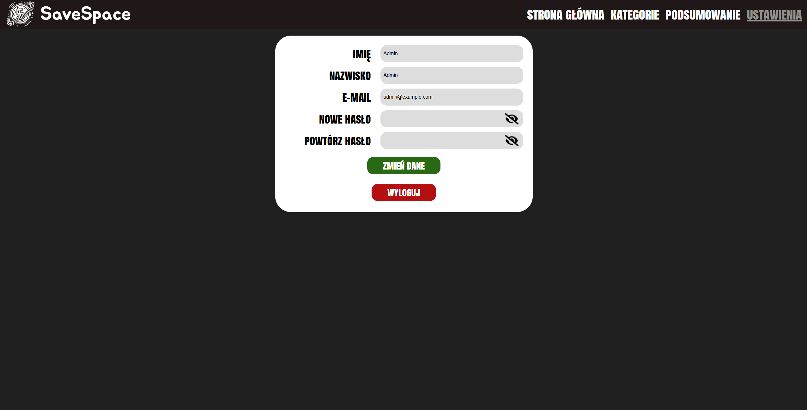
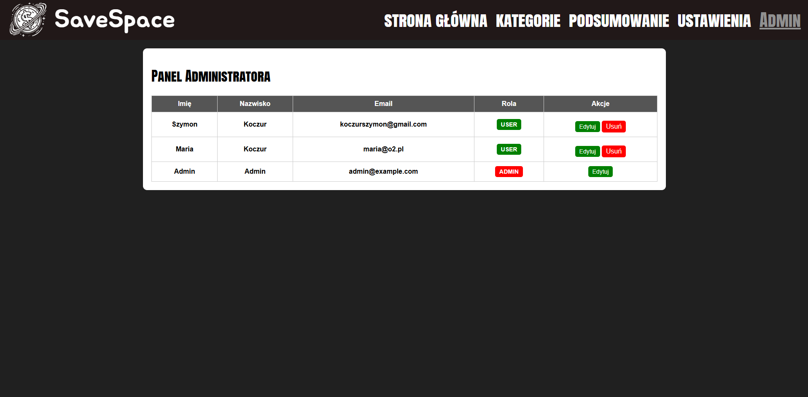
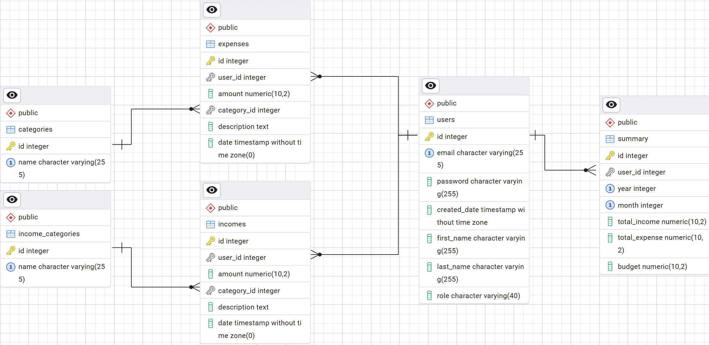

# SaveSpace
SaveSpace to aplikacja do zarządzania wydatkami i przychodami, umożliwiająca użytkownikom śledzenie ich finansów, kategoryzację transakcji oraz analizę budżetu.

# Pobranie aplikacji:
```
git clone https://github.com/SzymXonX/WdPAI_Project.git
```

# Uruchamianie:
## PC
1. Otwórz pobrane repozytorium w np. Visual Studio Code
2. Uruchom aplikacje Docker
3. Zbuduj docker-compose
```
docker-compose up --build
```
4. Po załadowaniu wszystkich kontenerów i serwisów udaj się w przeglądarce na adres http://localhost:8080/
5. Zaloguj się na utworzonych już użytkowników lub utwórz własne konto za pomocą "Nie masz konta?"
6. Korzystaj z aplikacji! 

## Smartphone
1. Kroki 1-3 jak w przypadku PC
2. Otwieramy konsole CMD i wpisujemy
```
ipconfig /all
```
3. Znajdujemy swoje IPv4
4. Wchodzimy w przeglądarkę na smartphonie i wpisujemy [adres IPv4]:8080 np. 10.0.0.2:8080
5. Korzystaj z aplikacji!

# Dostępni użytkownicy
## Admin:
Login: admin@example.com
Hasło: admin

## Userzy:
Login: koczurszymon@gmail.com
Hasło: 1234

Login: maria@o2.pl
Hasło: maria123

Na tych kontach znajdują się już przykładowe dane

# Opis działania podstron
## Strona główna
Na stronie głównej wyświetla się podsumowanie sumaryczne wybranego miesiąca wydatków, przychodów, budżetu oraz jednostkowe wydatki i przychody

W formularzu w prawym górnym można dodawać przychody lub wydatki

Za pomocą strzałek przy dacie można zmieniać miesiące

Aby wyświetlić opis wydatku wystarczy w niego kliknąć, 
znajduje się tam również przycisk usuwania wydatku/przychodu

!! UWAGA !! Usunięcie starego wydatku/przychodu skutkuje brakiem możliwości utworzenia go ponownie w danym czasie !! UWAGA !!

## Kategorie
W zakładce kategorie wyświetlają się kategorie wydatków i przychodów

W formularzu w górnej części ekranu można dodawać kategorię do obydwu grup

Za pomocą przycisku usuń usuwamy kategorię 

!! UWAGA !! Usunięcie kategorii skutuję usunięciem wszystkich wydatków/przychodów z nią związanych !! UWAGA !!

## Podsumowanie
Tutaj wyświetla się podsumowanie kategorii i sumaryczny wydatek w danym miesiącu na każdą kategorię

Przy dacie za pomocą strzałek również można zmieniać datę podsumowania

# Technologie
- HTML
- PHP
- CSS
- JavaScript
- PostgreSQL
- PDO
- nginx
- pgAdmin

# Logowanie do pgAdmin'a
1. Aby dostać się do pgAdmina wpisz w przeglądarke localhost:5050/
2. Zaloguj sie: Login - support@savespace.com    Hasło - password
3. Utwórz nowy serwer: 
Name - [nasza nazwa serwera], 
Connections/Hostname - postgres, 
Connection/Username - user,
Connection/Password - password
4. Gotowe, rozwiń zakładkę Servers/Database/Savespace

# Struktura katalogów
```
/Docker
    /nginx
        - Dockerfile
        - nginx.conf
    /php
        - Dockerfile
    /postgres
        - init.sql

/Figma
    - PC-Kategorie.png
    - PC-Logowanie.png
    - PC-Rejestracja.png
    - PC-Strona główna.png
    - PC-Ustawienia.png
    - Phone-kategorie.png
    - Phone-Logowanie.png
    - Phone-Rejestracja.png
    - Phone-Strona główna.png
    - Phone-Ustawienia.png

/Public
    /css
        - adminStyles.css
        - categoriesStyles.css
        - mainStyles.css
        - settingsStyles.css
        - styles.css
        - summaryStyles.css
    /Images
        - closed_eye_password.png
        - logo_bez_tla.png
        - logo.png
        - open_eye_password.png
    /js
        - adminScript.js
        - categoriesScript.js
        - menuScript.js
        - script.js
        - summaryScript.js
    /views
        - admin.php
        - categories.php
        - login.php
        - main.php
        - register.php
        - settings.php
        - summary.php
/ScreenShots
    - Admin.png
    - category.png
    - ERD_Diagram.png
    - login.png
    - mainPage.png
    - register.png
    - settings.png
    - summary.png

/Src
    /controllers
        - AdminController.php
        - AppController.php
        - CategoriesController.php
        - DefaultController.php
        - MainController.php
        - SecurityController.php
        - SettingsController.php
        - SummaryController.php
    /models
        - Category.php
        - Expense.php
        - Income.php
        - User.php

- .gitignore
- Database.php
- docker-compose.yml
- index.php
- README.MD
- Routing.php
```
# Zrzuty ekranu strony






# Baza danych
Kompletna baza danych znajduje się w pliku Docker/postgres/init.sql
Dodatkowe funkcje bazy danych:
Funkcje:
- getRole(user_id): Do funkcji przekazujemy user_id, zwraca role użytkownika

Triggery:
- update_summary_expense(): Po dodaniu rekordu do tabeli Expenses aktualizuje tabele Summary pole total_expense dodając wydatek do reszty
- update_summary_expense_delete(): Po usunięciu rekordu z tabeli Expenses aktualizuje Summary pole total_expense usuwając wydatek z reszty
- update_summary_income(): Po dodaniu rekordu do tabeli Incomes aktualizuje tabele Summary pole total_income  dodając przychód do reszty
- update_summary_income_delete(): Po usunięciu rekordu z tabeli Incomes aktualizuje Summary pole total_income usuwając przychód z reszty

Widoki:
- user_financial_summary(): Widok summarycznych wydatków/przychodów całościowych użytkowników
- category_financial_summary(): Widok sumaryczny kategorii wydatków/przychodów użytkowników

## ERD Diagram


# Autor
- Szymon Koczur
